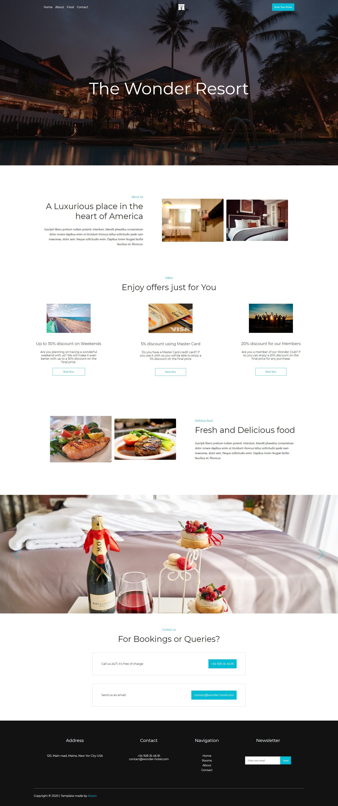

# Wonder Hotel
Wonder Hotel is a front-end project based on a made up hotel. The purpose of this project is practising React.js

## Live demo:

[Click here](https://sirwhiz.github.io/wonder-hotel/) to see a live demo of the project

## Installation

Download the code from the repository, install it with npm by running the following command:

### `npm install`

And then just start the local React server by typing:

### `npm start`

## Screenshots:

## Technology Stack
In this project I have used ReactJS as the main front end framework. All of the styling has been done by hand, no css 
frameworks or libraries have been used here.

## Contributing
All pull requests are welcome.

## License
[MIT](https://choosealicense.com/licenses/mit/)
